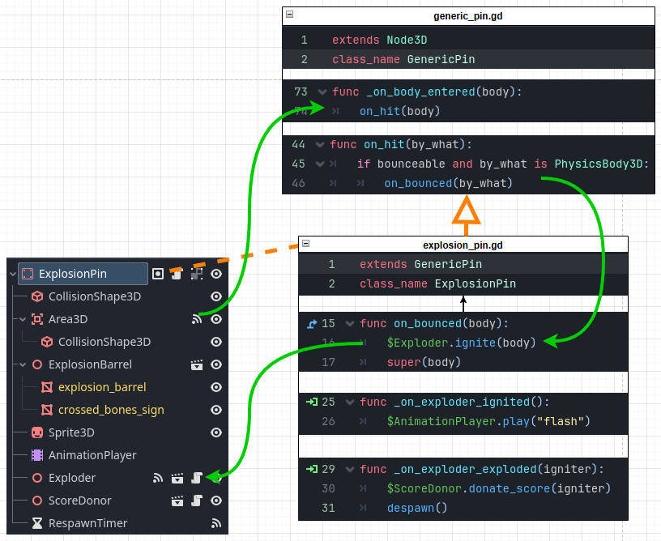
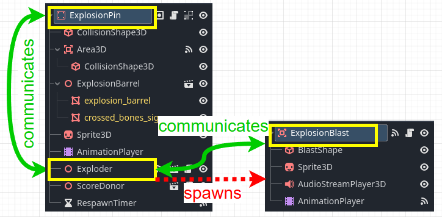

# Armachinko

My first semester project at S4G Berlin.   
As a Team of 8, in 10 weeks, we built a quirky pinball spin-off, where players take direct control of the ball \- in the shape of a shotgun-wielding armadillo chasing the highest ~~score~~ bounty in the wild west.

## Work
| | | | | | |
| :----: | :----: | :----: | :----: | :----: | :----: |
| **Programming** | Architecture | Movement | Camera | Interactions | UI |
| **Production/Lead** | Backlog | Meetings | Coordination | 1on1s | Mentoring |

I contributed to 107 out of 117 gd files.  
29 of which I collaborated on with team members.  
<!-- ... 97 had their last commit from me.  -->
<!--31 out of the 117 scripts got contributions from more than 1 person.  -->

## Learnings

Working on a team.  
Godot. Scrum.  
Managing a project and a team.  

## Team

3 Artists, 2 Designers, 2 Coders, 1 Composer.

## Engineering

### Architecture
Our core mechanic is this:   

> *Bounce pins to trigger effects like score, explosion etc.*   
	
This went through 3 iterations:   
#### 1. Duck-typing interfaces:    
GDScripts's mechanism for interfaces is ducktyping: we try to call a certain function on all "effect" nodes.   
This proved too inflexible. Effects triggering other effects were awkward to implement.
   
#### 2. Signals wherever possible:   
This approach promised an accessible workflow with less code.   
It turned out to be very confusing, because signal connections were hard to track.   
Also, we started employing inheritance for code re-use and structure.   
However, all functionality was encapsulated in components, and the parts connected with signals in editor.   
So the child class ExplosionPin actually had nothing to do!
   
#### 3. Signal up, call down:   
This improved readability: Parent-to-child communication happens explicitly in code.   
Signal connections are easier to guess, because they usually target the parent.   
   
Explosion feature was split into 3 classes:   
- Player interacts with **Explosion Pin**   
- Explosion Pin has **Exploder** effect  
- Exploder spawns **Explosion Blast**    

Communication is restricted to parent and child.   
   