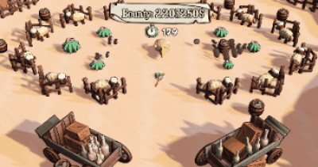
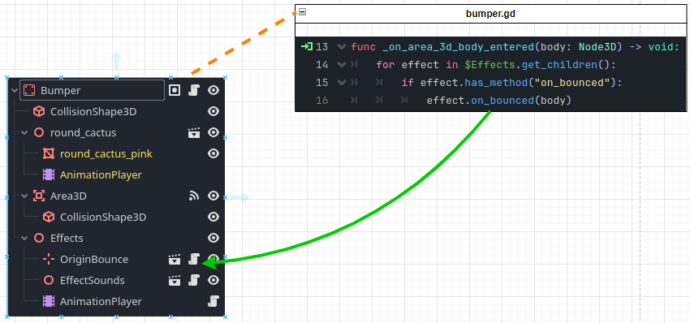
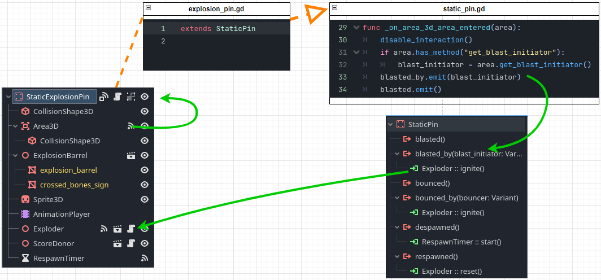
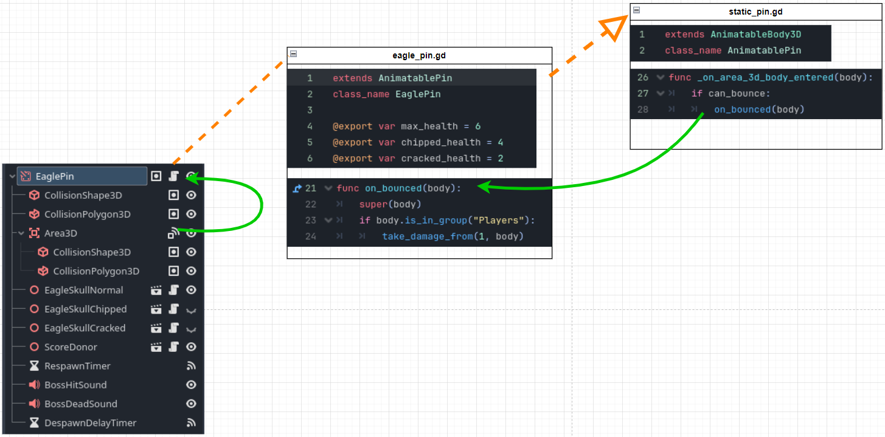

# Armachinko

My first semester project at S4G Berlin.   
As a Team of 8, in 10 weeks, we built a quirky pinball spin-off, where players take direct control of the ball \- in the shape of a shotgun-wielding armadillo chasing the highest ~~score~~ bounty in the wild west.

## Work
| | | | | | |
| :----: | :----: | :----: | :----: | :----: | :----: |
| **Programming** | Architecture | Movement | Camera | Interactions | UI |
| **Production/Lead** | Backlog | Meetings | Coordination | 1on1s | Mentoring |

I contributed to 107 out of 117 gd files.  
29 of which I collaborated on with team members.  
<!-- ... 97 had their last commit from me.  -->
<!--31 out of the 117 scripts got contributions from more than 1 person.  -->

## Engineering

### Architecture
core mechanic:   
bounce pins to trigger effects like score, explosion etc.   

went through 3 iterations:   
1. duck-typing interfaces:    
   
on collision triggers all the effects   
this proved too inflexible: delayed explosions were awkward to implement   
2. signals everywhere:   
   
promised easy no-code workflow   
poor readability, signal connections to track.   
3. signal up, call down:   
   

### Pins

## Learnings

Working on a team.  
Godot. Scrum.  
Managing a project and a team.  

## Team

3 Artists, 2 Designers, 2 Coders, 1 Composer.